# PHP Programming Screenshots

This folder contains screenshots demonstrating PHP programming concepts covered in the course **Web Application Development - PHP & MySQL**.

# PHP Control Structures, Loops and Arrays

This folder contains screenshots demonstrating the PHP concepts covered during Week 2 of the course:

**Web Application Development - PHP & MySQL**

---

# 1. PHP Constants and If / Else Statements

## Screenshot Name

`PHP_Constants_If_Else.png`

## Description

This screenshot demonstrates the use of PHP constants and conditional statements.

Main concepts covered:

* Creating a constant using `define()`.
* Displaying a constant using `echo`.
* Creating variables.
* Using `if` and `else` statements.
* Checking whether a person is an adult or a child.

### Code Covered

```php
define("Age", 12);
echo Age;

$Age = 20;

if ($Age >= 18) {
    echo "Adult";
} else {
    echo "Child";
}
```

## Screenshot

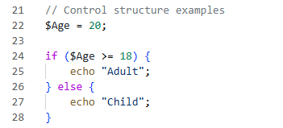

---

# 2. PHP Grade System

## Screenshot Name

`PHP_Grade_System.png`

## Description

This screenshot demonstrates how `if`, `elseif`, and `else` statements can be used to create a grading system.

The program checks the student's marks and assigns a grade.

Grade system:

* **90–100:** A
* **80–89:** B
* **70–79:** C
* **60–69:** D
* **Below 60:** Fail

### Code Covered

```php
$marks = 100;

if ($marks >= 90) {
    echo "A";
} elseif ($marks >= 80) {
    echo "B";
} elseif ($marks >= 70) {
    echo "C";
} elseif ($marks >= 60) {
    echo "D";
} else {
    echo "Fail";
}
```

## Screenshot

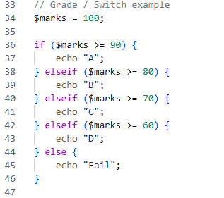

---

# 3. PHP Fuel Condition

## Screenshot Name

`PHP_Fuel_Condition.png`

## Description

This screenshot demonstrates another example of using an `if / else` statement.

The program checks the amount of fuel and displays either **"Low"** or **"Full"**.

### Code Covered

```php
$fuel = 5;

if ($fuel <= 1) {
    echo "Low";
} else {
    echo "Full";
}
```

## Screenshot

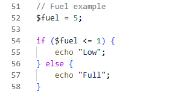

---

# 4. PHP While Loop

## Screenshot Name

`PHP_While_Loop.png`

## Description

This screenshot demonstrates the use of a `while` loop.

A `while` loop repeatedly executes a block of code as long as its condition is true.

The example displays numbers from 1 to 5.

### Code Covered

```php
$count = 1;

while ($count <= 5) {
    echo $count . "<br>";
    $count++;
}
```

## Screenshot

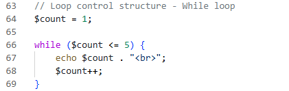

---

# 5. PHP Do While Loop

## Screenshot Name

`PHP_Do_While_Loop.png`

## Description

This screenshot demonstrates the use of a `do while` loop.

A `do while` loop executes the code first and then checks the condition. This means the code inside the loop will execute at least once.

### Code Covered

```php
do {
    echo $count . "<br>";
    $count++;
} while ($count <= 10);
```

## Screenshot

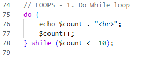

---

# 6. PHP For Loops

## Screenshot Name

`PHP_For_Loops.png`

## Description

This screenshot demonstrates different uses of the `for` loop.

The examples include:

* Creating a multiplication table of 12.
* Printing numbers from 1 to 15.
* Calculating the square of numbers from 1 to 10.

### Code Covered

```php
for ($count = 1; $count <= 12; $count++) {
    echo "$count times 12 is " . ($count * 12) . "<br>";
}
```

```php
for ($count = 1; $count <= 15; $count++) {
    echo $count . "<br>";
}
```

```php
for ($i = 1; $i <= 10; $i++) {
    echo "The square of $i is " . ($i * $i) . "<br>";
}
```

## Screenshot

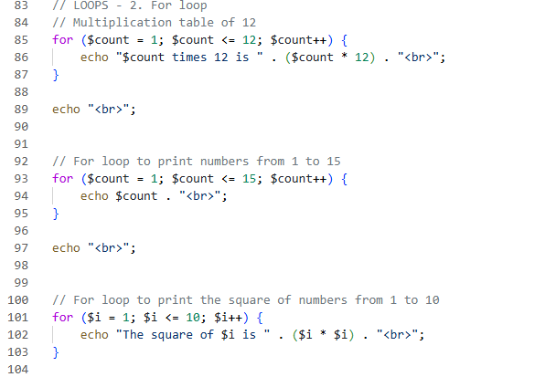

---

# 7. PHP Break Statement

## Screenshot Name

`PHP_Break_Statement.png`

## Description

This screenshot demonstrates the use of the `break` statement.

The `break` statement is used to immediately stop a loop when a specific condition is met.

In this example, the loop stops when `$i` reaches 10.

### Code Covered

```php
$i = 1;

while ($i <= 15) {
    echo "$i, ";
    $i++;

    if ($i == 10) {
        break;
    }
}
```

## Screenshot

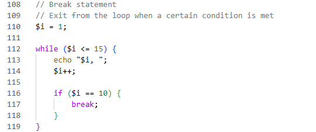

---

# 8. PHP Nested Loops

## Screenshot Name

`PHP_Nested_Loops.png`

## Description

This screenshot demonstrates nested loops.

A nested loop is a loop placed inside another loop.

The example uses two `for` loops to create a multiplication table using rows and columns.

### Code Covered

```php
for ($i = 1; $i <= 3; $i++) {

    for ($j = 1; $j <= 5; $j++) {
        echo ($i * $j) . " ";
    }

    echo "<br>";
}
```

## Screenshot

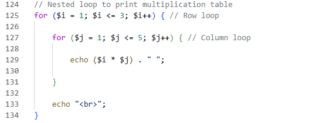

---

# 9. PHP Indexed Arrays

## Screenshot Name

`PHP_Indexed_Array.png`

## Description

This screenshot demonstrates how to create an indexed array and add values using numerical indexes.

### Code Covered

```php
$numbers = array();

$numbers[0] = 2;
$numbers[1] = "ALI";
```

The array contains two values:

* Index `0` contains `2`.
* Index `1` contains `"ALI"`.

## Screenshot

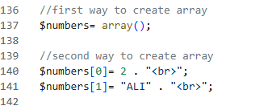

---

# 10. Displaying Arrays Using print_r()

## Screenshot Name

`PHP_Print_R_Array.png`

## Description

This screenshot demonstrates how to display the contents of an array using the `print_r()` function.

The `<pre>` HTML tag is used to make the array output easier to read.

### Code Covered

```php
echo "<pre>";
print_r($numbers);
echo "</pre>";
```

## Screenshot

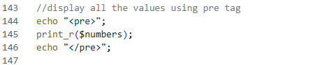

---

# 11. Using count() with an Array

## Screenshot Name

`PHP_Array_Count_For_Loop.png`

## Description

This screenshot demonstrates how to use the `count()` function with an array.

`count()` is used to determine the number of elements in an array.

A `for` loop is then used to display each value in the array.

### Code Covered

```php
for ($i = 0; $i < count($numbers); $i++) {
    echo $numbers[$i] . "<br>";
}
```

## Screenshot

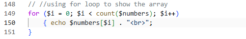

---

# 12. PHP Associative Arrays

## Screenshot Name

`PHP_Associative_Array.png`

## Description

This screenshot demonstrates the use of an associative array.

Unlike an indexed array, an associative array uses **keys and values** to store information.

The `=>` operator is used to connect a key with its value.

### Code Covered

```php
$info = array(
    "id" => "101",
    "name" => "Mohamed Abdi Ali",
    "age" => 20,
    "address" => "Hodan District",
    "status" => "single",
    "weight" => 160.5
);
```

Examples:

* `id` → `101`
* `name` → `Mohamed Abdi Ali`
* `age` → `20`
* `address` → `Hodan District`
* `status` → `single`
* `weight` → `160.5`

## Screenshot

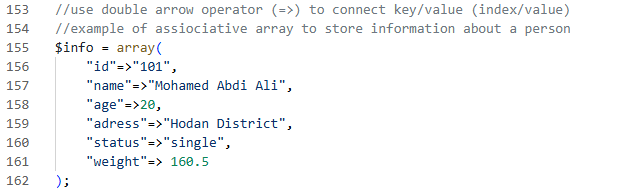

---

# 13. PHP print_r() and var_dump()

## Screenshot Name

`PHP_Print_R_Var_Dump.png`

## Description

This screenshot demonstrates two functions used to inspect and display information stored in an array.

### print_r()

`print_r()` displays the contents of an array in a readable format.

### var_dump()

`var_dump()` displays detailed information about a variable, including its data type and value.

### Code Covered

```php
echo "<pre>";

echo "Information about the person:<br>";

print_r($info);

echo "</pre>";

echo "<pre>";
var_dump($info);
echo "</pre>";
```

## Screenshot

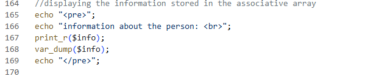

---

# Summary

The Week 2 screenshots demonstrate the main PHP programming concepts covered during the week:

* PHP constants
* `if / else` statements
* `elseif` statements
* Grade conditions
* `while` loops
* `do while` loops
* `for` loops
* `break` statements
* Nested loops
* Indexed arrays
* `count()`
* `print_r()`
* Associative arrays
* Key/value pairs using `=>`
* `var_dump()`

These concepts introduce the fundamentals of **conditional programming, repetition, and data storage in PHP**.
